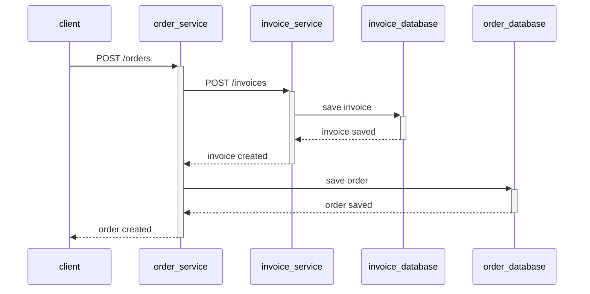
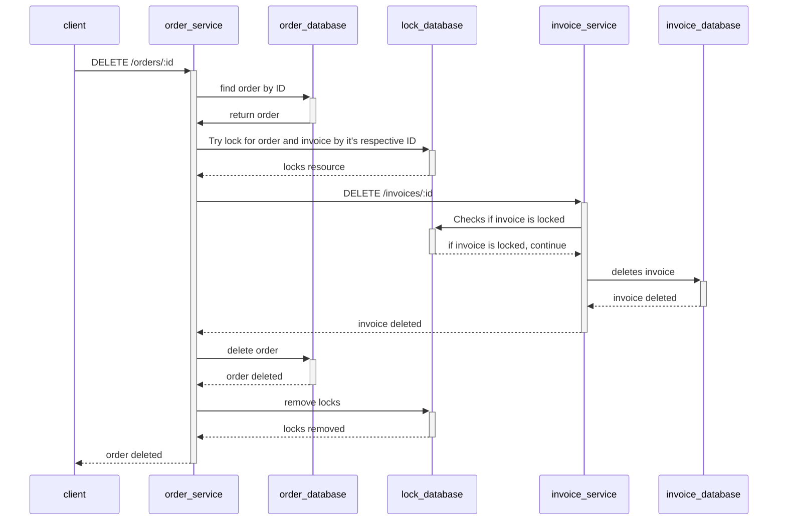
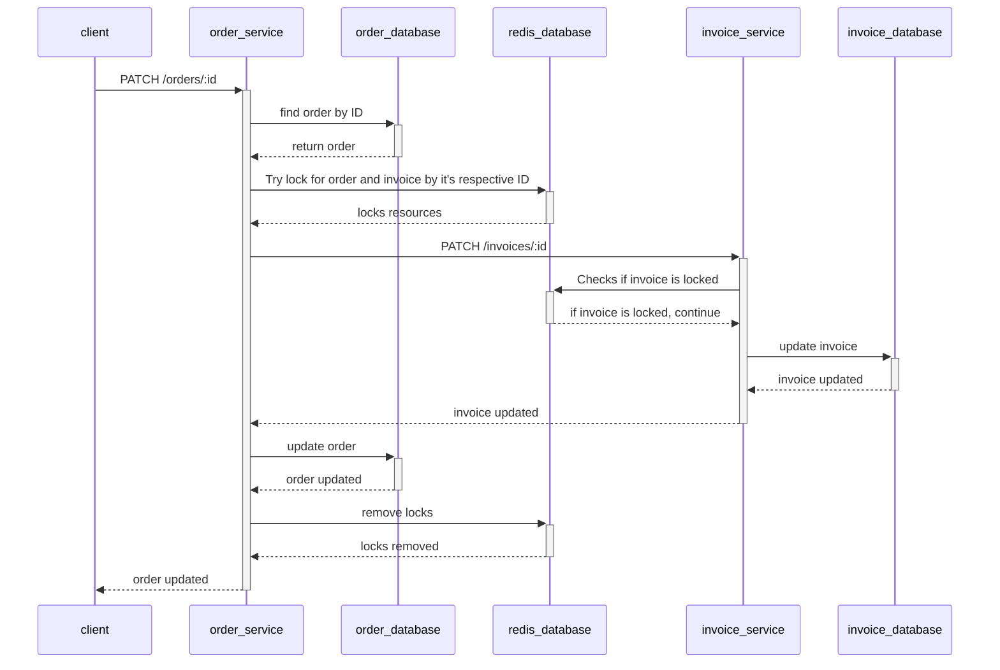

<h1 align="center">Distributed lock</h1>

## 📜 Summary
- [About](#About)
- [Run](#Run)
- [Docs](#Docs)
- [Endpoints](#Endpoints)
- [Tracing](#Tracing)

<a id="About"></a> 
## 📃 About
This is a project to try and test distributed locks using Redis. There's 2 services(orders and invoices) that have CRUD operations and 
one update or delete request should reflect in both systems avoiding inconsistency. The idea is that for any reason there's a concurrent requests to update/delete these resources, one should not affect the other. See the <a href="#Docs">Docs</a> section
for more details.

<a id="Run"></a> 
## ⚙️ Run

There's two ways of starting this project: using docker to start the webserver and the infrastructure or starting the infrastructure via docker and
starting the server on your machine.

### Using docker-compose for infra and webserver

Run one of the commands below to build golang image:

```bash
docker-compose -f docker-compose.production.yml build
```

```bash
make build
```

Then run one of the commands below to start the containers:

```bash
docker-compose -f docker-compose.production.yml up -d
```

```bash
make run_prod
```

If you want to destroy it all, run one of the commands below:

```bash
docker-compose -f docker-compose.production.yml down
```

```bash
make infra_down_prod
```

### Using docker-compose for infrastructure and webserver locally

To run the webserver locally, you need to have installed Go on version 1.22.6.<br>

run one of the commands below: 

```bash
docker compose up -d
```

```bash
make infra
```

then start the api:

```bash
go run main.go --env=local
```

```bash
make run
```

If you want to destroy the database's docker, run one of the commands below:

```bash
docker compose down 
```

```bash
make infra_down
```

<a id="Docs"></a> 
## 🧾 Docs

There's a .json file that you can import on Postman to make requests to the endpoints.
Down below you will see informations about the endpoints. There's mermaids sequenceDiagram to ilustrate all the steps.
You can check the mermaid's doc <a href="https://mermaid.js.org/syntax/sequenceDiagram.html">here</a> and the online editor <a href="https://mermaid.js.org/syntax/sequenceDiagram.html"> here</a> 
The intentions of these sequenceDiagrams are to show the communications between the components and demonstrating the 'happy path' of each flow. For more details, you should look into the code.

<h4>Create order</h4>


---

<h4>Delete order</h4>


---
<h4>Update order</h4>



---

<a id="Endpoints"></a> 
## 💻 Endpoints

In this section you will find all the curls to make http requests for the service Order.

Create Order

```curl
curl --location 'localhost:3000/orders' \
--header 'Content-Type: application/json' \
--data '{
    "user_id": "2297b055-cb7e-43c7-9b21-70b2e29f722e",
    "item_id": "c7558f2b-d319-4dd2-ba4f-0a1d98fb61a2",
    "quantity": 2,
    "value": 100
}'
```

Update Order

```curl
curl --location --request PATCH 'localhost:3000/orders/47378eb4-e4d4-4c62-a0bb-26baf4d18e87' \
--header 'Content-Type: application/json' \
--data '{
    "update_time": "2025-05-03T18:00:00Z",
    "quantity": 5,
    "value": 200
}'
```

Delete Order

```curl
curl --location --request DELETE 'localhost:3000/orders/9088b54e-313e-43cd-8988-e8879ced2eb9'
```