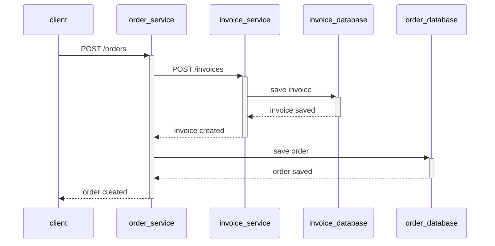
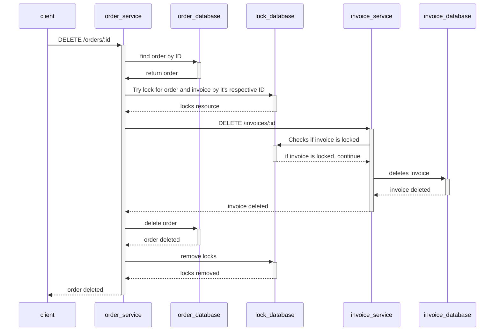

<h1 align="center">Distributed lock</h1>

## 📜 Summary
- [About](#About)
- [Docs](#Docs)
- [Libs/Dependencies](#Libs/Dependencies)
- [Run](#Run)
- [Endpoints](#Endpoints)
- [Tracing](#Tracing)

 
## 📃 About
This is a project to try and test distributed locks using Redis. There's 2 services(orders and invoices) that have CRUD operations and 
one update or delete request should reflect in both systems avoiding inconsistency. See the <a href="#Endpoints">endpoints</a> section
for more details.

 
## 💻 Endpoints

In this section you will see informations about the endpoints. There's mermaids sequenceDiagram to ilustrate all the steps.
You can check the mermaid's doc <a href="https://mermaid.js.org/syntax/sequenceDiagram.html">here</a> and the online editor <a href="https://mermaid.js.org/syntax/sequenceDiagram.html"> here</a> 

The intentions of these sequenceDiagrams are to show the communications between the components and demonstrating the 'happy path' of each flow. For more details, you should look into the code.

<h4>Create order</h4>

---

<h4>Delete order</h4>

